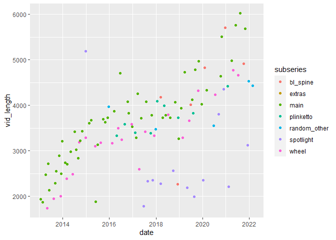

Landing Page
================
Alex Socarras
3/26/2022

Hello world.

``` r
library(dplyr)
```

    ## 
    ## Attaching package: 'dplyr'

    ## The following objects are masked from 'package:stats':
    ## 
    ##     filter, lag

    ## The following objects are masked from 'package:base':
    ## 
    ##     intersect, setdiff, setequal, union

``` r
library(ggplot2)
library(lubridate)
```

    ## 
    ## Attaching package: 'lubridate'

    ## The following objects are masked from 'package:base':
    ## 
    ##     date, intersect, setdiff, union

``` r
tibs <- readxl::read_xlsx("BestoftheWorst/data/botw_all2.xlsx") %>% mutate(date = ymd_hms(date), vid_length = duration(duration))
```

Now we want to try adding a plot to our rmd file, checking that it gets
added to our md file under the landingpage\_files folder, then
committing and pushing all that to github.

``` r
tibs %>% ggplot(aes(x = date, y = vid_length, color = subseries)) + geom_point()
```

    ## Warning: Removed 11 rows containing missing values (geom_point).

<!-- -->
